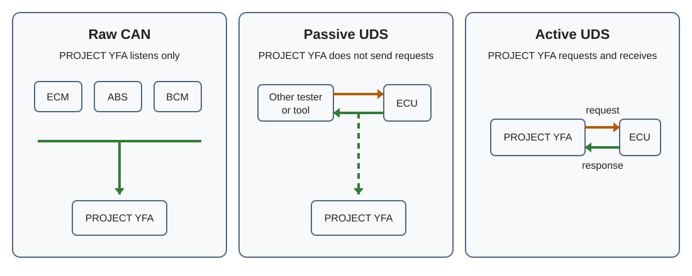

# Live Signals

**Live Signals** is the main real-time data view in PROJECT YFA. It decodes selected vehicle data for the currently selected ECU and can show the results as live values or plots.

## ECU tabs

With the USB CANnectivity transport, the first tab is **ECUs**. It provides an aggregate view across the supported control units. The individual ECU tabs remain available after it:

- ECM
- ABS
- AWD
- BCM
- KLS
- HVAC
- PS
- IPC
- SRS
- CGW

The **ECUs** tab is available only with the USB CANnectivity transport. Its signal list can combine definitions from multiple supported ECUs; the individual tabs continue to use the selected ECU only.

The available requests, CAN frames, and signals depend on the PROJECT YFA signal database.

## Aggregate ECUs tab

On the **ECUs** tab, Play starts one acquisition session that can collect signals from multiple ECUs. The same Raw CAN, Passive UDS, and Active UDS choices are supported.

In **Raw CAN**, the aggregate session listens to the full CAN bus and decodes frames that match known PROJECT YFA ECU definitions. It does not perform an ECU presence scan before starting.

In **Passive UDS**, PROJECT YFA listens for configured diagnostic responses from the supported ECUs without transmitting requests. ECUs are identified as their response traffic is observed, so no Tester Present presence scan is performed before acquisition.

In **Active UDS**, PROJECT YFA first checks only ECUs that have selected Active UDS requests. Online ECUs are shown in the status area, and the selected requests for those ECUs are then polled in one multi-ECU session.

The aggregate Live grid uses the same responsive layout, inactive-signal indication, signal ordering, and Live/Plot gestures as an individual ECU tab.

## Starting and stopping acquisition

Press **Play** to start acquisition. While acquisition is running, the control changes to **Stop**.

The acquisition mode is selected in **Settings → Connection → Acquisition mode**. If **Ask first** is selected, PROJECT YFA asks which mode to use when acquisition starts.

Stopping an acquisition ends the current data session. If logging is enabled and data has been written, PROJECT YFA asks for confirmation before closing the current log file.

## Acquisition modes

PROJECT YFA supports three data-acquisition methods.

{ width="900" }

### Raw CAN

**Raw CAN** decodes selected signals directly from CAN frames.

Use this mode for signals that PROJECT YFA can obtain from normal CAN traffic without diagnostic requests. Only enabled CAN IDs are monitored for the selected ECU.

### Passive UDS

**Passive UDS** listens for selected UDS responses without sending requests.

With the USB CAN adapter, PROJECT YFA monitors the selected ECU response CAN ID and reconstructs UDS messages from traffic already present on the bus. This is useful when another diagnostic tester or device is already requesting the data.

Passive UDS does **not** itself generate the diagnostic requests needed to make an otherwise silent ECU send those responses.

### Active UDS

**Active UDS** actively requests selected UDS data from the ECU.

PROJECT YFA uses the configured diagnostic TX/RX IDs for the selected ECU and polls the enabled requests. This mode therefore transmits diagnostic CAN traffic as well as receiving responses.

!!! note
    Raw CAN and Passive UDS can obtain data without PROJECT YFA generating UDS requests. Active UDS is different: it deliberately communicates with the selected ECU.

## Live and Plot views

The overflow menu lets you switch between **Live** and **Plot**.

**Live** displays the selected decoded signal values. **Plot** displays signals that have been selected for plotting.

You can also double-tap the data area to switch between the Live and Plot views.

## Display layout

The Live signal grid automatically adapts to the width available on the screen. It uses one column below 480 dp, two columns from 480 dp, three from 720 dp, and four from 1000 dp.

Signals are arranged from top to bottom within a column and then continue in the next column to the right. This lets the same Live view make better use of portrait phones, landscape displays, and other wide screens.

## Choosing signals

Open **Signals** from the overflow menu to configure the data associated with an ECU.

PROJECT YFA stores signal preferences per ECU and request/CAN frame. A signal has separate **visible** and **plot** states:

- **Visible** controls whether the signal appears in the normal Live view.
- **Plot** selects the signal for the Plot view.
- A signal selected only for plotting is still included in acquisition even when it is hidden from Live view.

The configured signal order is also used when presenting decoded values.

User choices are stored by the application. When the packaged signal database changes, PROJECT YFA reconciles the stored settings with the current database so that valid existing choices are retained and newly introduced signal definitions can be added.

## Details view

The Live Signals screen can show the underlying data associated with the selected signals.

For **Raw CAN**, Details identifies the CAN ID and payload length and displays the frame payload as a byte grid.

For **Passive UDS** and **Active UDS**, Details shows the diagnostic request/response context, including the TX ID and request, the RX ID and expected positive-response prefix, and the response payload byte grid.

This view is useful when comparing a decoded signal with its source bytes.

## ECU information

Choose **ECU info** from the overflow menu to open information for the currently selected ECU.

## Logging

Logging can be enabled from the Live Signals overflow menu. The destination directory is configured under **Settings → Logging → Log directory**.

If logging is enabled but PROJECT YFA does not yet have access to a log directory, starting acquisition opens Android's directory picker.

When an acquisition that has written log data is stopped, PROJECT YFA warns that the current log file will be closed.

Adapter debug logging is a separate option under **Settings → Logging** and writes to the root's **debug/** child directory.

## MQTT

The overflow menu also provides the **MQTT** control. Broker configuration is under **Settings → Connection → MQTT broker**.

MQTT is an acquisition-session feature. Enabling the control does not keep a broker connection open while acquisition is stopped. When acquisition starts, CANly connects if MQTT is enabled; when acquisition stops, it publishes retained `offline` when possible and disconnects.

The broker configuration includes:

- host or IP address
- port
- optional username
- optional password
- base topic
- TLS on/off

Signals are selected for MQTT separately in the **Signals** editor with the cloud-upload control. A signal may be MQTT-only and does not need to be visible in LIVE or PLOT.

MQTT is independent of acquisition logging and can be used with any acquisition mode that produces the selected decoded signals.

## Connection and display settings

The Settings screen is divided into **View**, **Connection**, and **Logging** sections.

**View** contains the theme setting and an option to keep the screen on during acquisition.

**Connection** contains the adapter connection type, acquisition mode, and MQTT broker configuration.

**Logging** contains the log directory and adapter debug logging.

## Troubleshooting Live Signals

If no values appear, work through the data path in order:

1. Confirm that the expected adapter is selected and connected.
2. Confirm that the correct ECU tab is selected.
3. Confirm that the required request or CAN ID and signals are enabled.
4. Check that the selected acquisition mode matches the data source.
5. For Active UDS, remember that successful CAN reception alone does not prove that diagnostic transmission and ECU responses are working.
6. Use **Details** to inspect the underlying CAN or UDS payload when decoded values are missing or unexpected.

For USB troubleshooting, PROJECT YFA's debug log can be compared with an independent CAN-bus recording when one is available.

