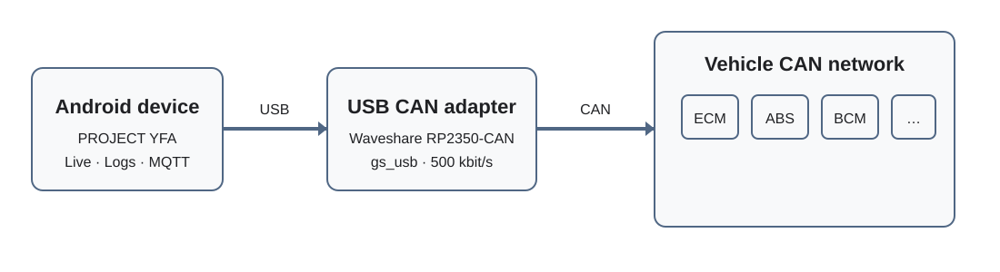

# Огляд USB CAN-адаптера

PROJECT YFA може обмінюватися даними з автомобілем через USB CAN-адаптер з інтерфейсом **gs_usb**.

Адаптер є мостом між USB Android-пристрою та CAN-шиною автомобіля. PROJECT YFA керує USB-з'єднанням Android і використовує той самий адаптер по-різному залежно від вибраного режиму зчитування.

{ width="900" }

## Вибір USB-адаптера

Відкрийте **Налаштування → Підключення → Адаптер** і виберіть **USB CANnectivity**.

Поточний адаптер для розробки — Waveshare RP2350-CAN із версією прошивки CANnectivity/Bridle для PROJECT YFA.

Після вибору USB-транспорту підключіть адаптер до Android-пристрою та скористайтеся елементом керування підключенням у PROJECT YFA. Під час першого відкриття адаптера Android може показати запит дозволу на доступ до USB. Для доступу PROJECT YFA до адаптера цей дозвіл потрібно надати.

Після успішного підключення PROJECT YFA показує назву USB-адаптера та повідомлену ним тактову частоту CAN.

!!! note "Примітка"
    Підключення USB-адаптера та запуск зчитування CAN — це окремі операції. Успішне USB-підключення означає, що PROJECT YFA відкрив і перевірив адаптер. CAN-канал налаштовується та запускається під час початку сеансу зчитування.

## Керування USER LED

З прошивкою PROJECT YFA Android-застосунок може керувати USER LED плати Waveshare під час роботи.

Налаштування розташоване в **Налаштування → Підключення → Вимкнути індикатор USER**. Коли воно ввімкнене, PROJECT YFA надсилає runtime-налаштування прошивки після кожного USB-підключення, і USER LED залишається вимкненим навіть під час приймання або передавання CAN-трафіку. Коли опцію вимкнено, використовується звичайна індикація стану/активності прошивки.

Адаптер не зберігає цю опцію у flash-пам'яті. Апаратний reset повертає звичайну поведінку LED, доки PROJECT YFA знову не підключиться та не застосує збережене налаштування застосунку.

## Режими зчитування

### Raw CAN

У режимі **Raw CAN** PROJECT YFA налаштовує адаптер на Classical CAN зі швидкістю 500 кбіт/с і запускає його в режимі **listen-only** з апаратними часовими мітками.

У цьому режимі адаптер приймає CAN-трафік автомобіля, але не передає CAN-кадри та не підтверджує трафік у шині. PROJECT YFA фільтрує та декодує CAN ID, вибрані в редакторі сигналів.

### Пасивний UDS

**Пасивний UDS** для USB-транспорту також працює лише на приймання.

PROJECT YFA відстежує CAN ID відповідей вибраного ECU через шлях приймання Raw CAN. Отримані CAN-кадри збираються в повні UDS-відповіді та зіставляються з вибраними запитами. У режимі Пасивного UDS PROJECT YFA **не передає** ці запити; відповідний діагностичний трафік уже має бути присутнім у CAN-шині.

### Активний UDS

У режимі **Активного UDS** PROJECT YFA запускає CAN-канал з апаратними часовими мітками, але без режиму listen-only. Тому адаптер може передавати діагностичні CAN-кадри та приймати відповіді ECU.

Для Активного UDS мають правильно працювати обидва напрямки USB/CAN-транспорту. Успішне приймання Raw CAN саме по собі не доводить, що передавання діагностичних запитів працює.

## Зведене зчитування ECUs

Коли вибрано USB CANnectivity, PROJECT YFA додає вкладку **ECUs** перед окремими вкладками ECU. Цей зведений режим може в одному сеансі отримувати та показувати сигнали з кількох підтримуваних ECU.

Зведений Raw CAN використовує нефільтроване приймання gs_usb, тому весь отриманий трафік шини може записуватися до журналу, а відомі CAN ID — декодуватися. Зведений Пасивний UDS відстежує трафік відповідей налаштованих профілів ECU без передавання діагностичних запитів. Зведений Активний UDS може перевіряти ECU-кандидати та циклічно виконувати вибрані запити для кількох ECU, що відповіли.

Зараз зведена функція є специфічною для USB-транспорту й не показується для Bluetooth ELM327.

## Перевірки USB-підключення

Поточна реалізація USB у PROJECT YFA очікує, що адаптер для розробки визначатиметься з USB VID **0x1209** і PID **0xCA01**. Під час підключення PROJECT YFA відкриває та захоплює інтерфейс gs_usb, знаходить його bulk IN та OUT endpoints і перевіряє можливості адаптера, потрібні програмі.

Поточний транспорт вимагає підтримки:

- режиму listen-only;
- апаратних часових міток CAN;
- тактової частоти CAN 8 МГц.

Якщо одна з цих вимог не виконується, USB-підключення відхиляється, щоб не запускати зчитування з неочікуваною конфігурацією.

## Відключення адаптера

PROJECT YFA відстежує події від'єднання USB в Android. Якщо підключений адаптер фізично від'єднати, програма закриває USB-з'єднання та припиняє активний стан транспорту.

Перед навмисним від'єднанням адаптера зупиніть зчитування.

## Усунення проблем

Якщо USB-адаптер не виявлено, перевірте фізичне USB-з'єднання та переконайтеся, що в Налаштуваннях вибрано **USB CANnectivity**. Перепідключіть адаптер і надайте Android дозвіл на USB, якщо з'явиться відповідний запит.

Якщо адаптер підключається, але зчитування не запускається, перевірте, чи ввімкнені потрібні групи RAW CAN або UDS-запити/сигнали для вибраного ECU.

Для діагностики проблем транспорту параметр **Налаштування → Запис → Діагностичний журнал адаптера** може записувати докладну USB-діагностику до вибраного каталогу журналів.

На сторінці Waveshare RP2350-CAN описано поточну прошивку та специфічні для PROJECT YFA зміни буферів gs_usb.
