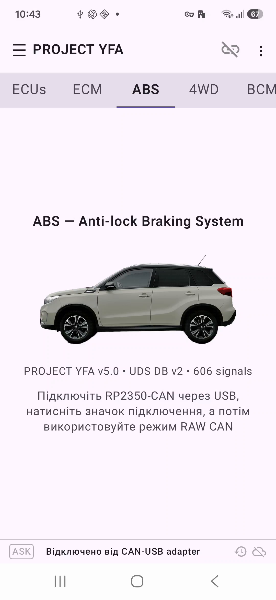
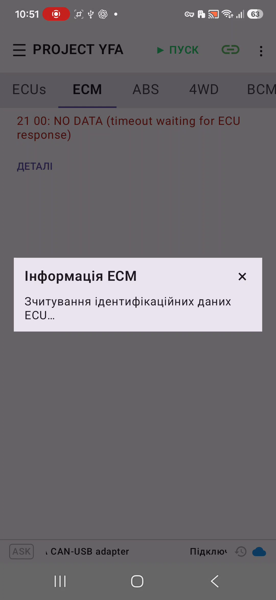

# Інформація ECU

**Інформація ECU** виконує одноразове зчитування ідентифікаційних даних ECU, вибраного на головному екрані.

Використовуйте цю функцію, коли автомобіль нерухомий і діагностичне з'єднання доступне.

## Інформація про всі ECU

З **USB CANnectivity** зведена вкладка **ECUs** має спільну операцію читання інформації ECU. PROJECT YFA спочатку перевіряє налаштовані профілі ECU за допомогою Tester Present. Потім для ECU, що відповіли, виконуються запити ідентифікації, а декодовані значення показуються окремими групами для кожного ECU.

<figure markdown="span">
  { width="420" }
  <figcaption>Зведений діалог інформації ECU для адаптера USB CANnectivity.</figcaption>
</figure>

Діалог показує назви виявлених ECU, декодовані поля ідентифікації кожного ECU та кількість невдалих запитів ідентифікації. Закриття діалогу зупиняє незавершену перевірку присутності або операцію ідентифікації.

Ця спільна операція доступна лише через USB і використовує активний діагностичний обмін.

## Відкриття Інформації ECU

Виберіть потрібну вкладку ECU, відкрийте меню головного екрана та виберіть **Інформація ECU**.

Команда доступна лише тоді, коли PROJECT YFA підключений і не виконується звичайне опитування, пасивний моніторинг або сеанс Raw CAN.

PROJECT YFA бере запити ідентифікації зі вбудованих баз запитів і сигналів. Використовуються лише запити, які відомі каталогу відповідей і мають визначення сигналів **IDENTIFICATION**.

Якщо для вибраного ECU немає визначень ідентифікації, діалог повідомляє, що сигнали ідентифікації ECU не визначені.

## Зчитування через Bluetooth ELM327

З **Bluetooth ELM327** PROJECT YFA один раз виконує запити ідентифікації через звичайний шлях діагностичних запитів.

Успішні відповіді декодуються та відображаються. Помилка окремого запиту не обов'язково заважає показати значення з інших успішних запитів ідентифікації.

<figure markdown="span">
  { width="420" }
  <figcaption>Приклад декодованої ідентифікаційної інформації для окремого ECU.</figcaption>
</figure>

## Зчитування через USB CANnectivity

З **USB CANnectivity** Інформація ECU використовує транспорт Активного UDS.

PROJECT YFA використовує налаштовані діагностичні TX та RX CAN ID вибраного ECU і один раз надсилає кожен запит ідентифікації. Опитування зупиняється, коли для всіх запитаних елементів отримано відповідь або помилку.

Отже, Інформація ECU є активною діагностичною операцією, навіть якщо звичайним режимом зчитування в Налаштуваннях вибрано Raw CAN або Пасивний UDS.

## Відображені значення

Декодовані значення ідентифікації впорядковуються за порядком відображення в базі, а потім за назвою. Однакові назви сигналів показуються лише один раз.

Точний набір полів залежить від ECU та визначень у базі PROJECT YFA. Тому діалог не припускає, що кожен ECU надає однаковий номер ПЗ, ідентифікатор калібрування, версію, дату чи інші поля ідентифікації.

Для деяких значень використовується спеціальне форматування. Наприклад, **Software date** ECM із запиту `1A99` показується як `YYYY-MM-DD`, якщо BCD-значення коректне, а поля з назвою **Version** форматуються як шістнадцяткові.

Якщо отримані дані не вдалося декодувати в поля ідентифікації, PROJECT YFA повідомляє про це. Також показується кількість окремих запитів ідентифікації, які завершилися помилкою.

## Пов'язані сторінки

Для безперервних вимірювань дивіться **Налаштування сигналів** і **Live Signals**. Інформація ECU призначена для ідентифікаційних даних, а не для безперервного зчитування.
