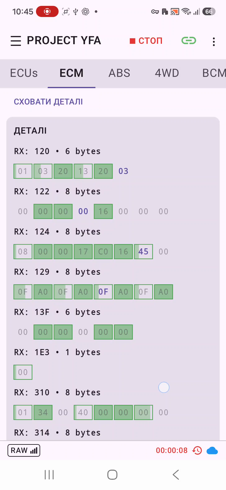
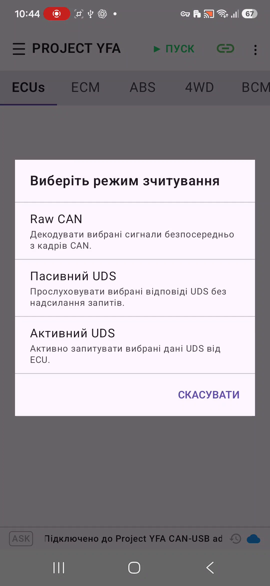
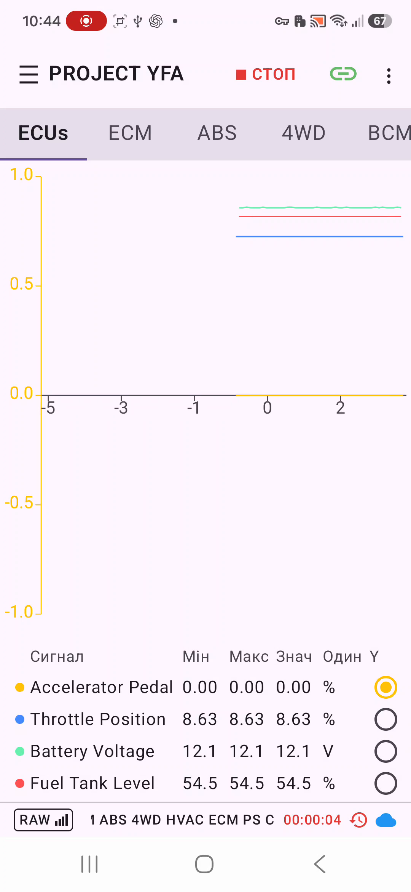
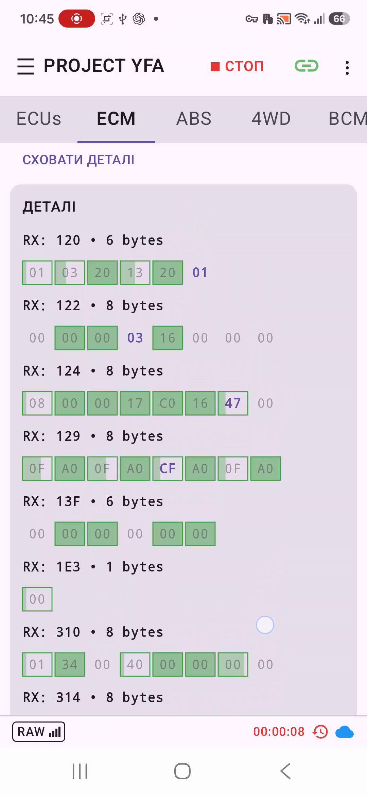
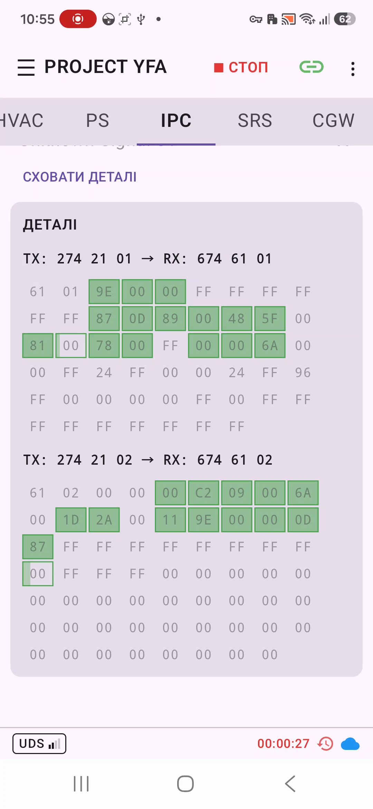
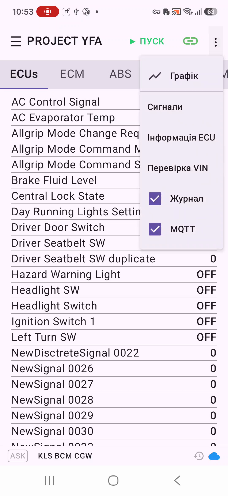

# Живі сигнали

**Живі сигнали** — основний екран PROJECT YFA для перегляду даних автомобіля в реальному часі. Він декодує вибрані дані для поточного ECU та може показувати результати як поточні значення або графіки.

## Вкладки ECU

При використанні USB CANnectivity першою є вкладка **ECUs**. Вона надає зведений перегляд даних кількох підтримуваних блоків. Після неї залишаються окремі вкладки ECU:

- ECM
- ABS
- AWD
- BCM
- KLS
- HVAC
- PS
- IPC
- SRS
- CGW

Вкладка **ECUs** доступна лише з транспортом USB CANnectivity. Її список сигналів може об'єднувати визначення кількох підтримуваних ECU; окремі вкладки, як і раніше, працюють лише з вибраним ECU.

Доступні запити, CAN-кадри та сигнали залежать від бази сигналів PROJECT YFA.

## Зведена вкладка ECUs

На вкладці **ECUs** кнопка Play запускає один сеанс, який може збирати сигнали з кількох ECU. Підтримуються ті самі режими Raw CAN, Пасивний UDS та Активний UDS.

У **Raw CAN** зведений сеанс прослуховує всю CAN-шину та декодує кадри, що відповідають відомим визначенням ECU у PROJECT YFA. Перед запуском сканування присутності ECU не виконується.

У **Пасивному UDS** PROJECT YFA прослуховує налаштовані діагностичні відповіді підтримуваних ECU без передавання запитів. ECU визначаються за фактично побаченим трафіком відповідей, тому попередня перевірка Tester Present не виконується.

В **Активному UDS** PROJECT YFA спочатку перевіряє лише ECU, для яких вибрано запити Active UDS. ECU, що відповіли, показуються в рядку стану, після чого вибрані запити до них виконуються в одному multi-ECU сеансі.

Зведена сітка Live використовує те саме адаптивне компонування, індикацію неактивних сигналів, порядок сигналів і жести Live/Plot, що й окрема вкладка ECU.

<figure markdown="span">
  { width="420" }
  <figcaption>Зведений Live-перегляд ECUs під час Активного UDS.</figcaption>
</figure>

## Запуск і зупинка зчитування

Натисніть **Play**, щоб почати зчитування. Під час зчитування ця кнопка змінюється на **Stop**.

Режим зчитування вибирається в **Налаштування → Підключення → Режим зчитування**. Якщо вибрано **Запитувати**, PROJECT YFA запропонує вибрати режим під час запуску.

<figure markdown="span">
  { width="420" }
  <figcaption>Діалог вибору режиму зчитування перед запуском.</figcaption>
</figure>

Зупинка завершує поточний сеанс зчитування. Якщо журналювання ввімкнене і дані вже записувалися, PROJECT YFA попросить підтвердити закриття поточного файла журналу.

## Режими зчитування

PROJECT YFA підтримує три способи отримання даних.

{ width="900" }

### Raw CAN

**Raw CAN** декодує вибрані сигнали безпосередньо з CAN-кадрів.

Цей режим призначений для сигналів, які PROJECT YFA може отримувати зі звичайного CAN-трафіку без діагностичних запитів. Для вибраного ECU відстежуються лише ввімкнені CAN ID.

### Пасивний UDS

**Пасивний UDS** прослуховує вибрані відповіді UDS без надсилання запитів.

При використанні USB CAN-адаптера PROJECT YFA відстежує CAN ID відповіді вибраного ECU та збирає UDS-повідомлення з трафіку, який уже присутній на шині. Це корисно, коли дані вже запитує інший діагностичний тестер або пристрій.

Пасивний UDS **не** генерує діагностичних запитів, необхідних для того, щоб ECU, який мовчить, почав надсилати ці відповіді.

### Активний UDS

**Активний UDS** активно запитує вибрані дані UDS від ECU.

PROJECT YFA використовує налаштовані діагностичні TX/RX ID вибраного ECU та циклічно виконує ввімкнені запити. Тому в цьому режимі застосунок не лише приймає відповіді, а й передає діагностичний CAN-трафік.

!!! note "Примітка"
    Raw CAN і Пасивний UDS можуть отримувати дані без генерування UDS-запитів самим PROJECT YFA. Активний UDS відрізняється тим, що застосунок навмисно обмінюється діагностичними повідомленнями з вибраним ECU.

## Режими Live і Plot

Меню додаткових дій дозволяє перемикатися між **Live** і **Plot**.

**Live** показує вибрані декодовані значення сигналів. **Plot** показує сигнали, вибрані для побудови графіків.

Також між Live і Plot можна перемикатися подвійним дотиком до області даних.

<figure markdown="span">
  { width="420" }
  <figcaption>Режим Plot із вибраними сигналами та їхньою історією.</figcaption>
</figure>

## Компонування екрана

Сітка сигналів Live автоматично пристосовується до доступної ширини екрана. Вона використовує одну колонку при ширині менше 480 dp, дві — від 480 dp, три — від 720 dp і чотири — від 1000 dp.

Сигнали розташовуються зверху вниз у межах колонки, після чого продовжуються в наступній колонці праворуч. Завдяки цьому той самий режим Live ефективніше використовує простір на телефонах у портретній орієнтації, дисплеях у альбомній орієнтації та інших широких екранах.

## Вибір сигналів

Відкрийте **Signals** у меню додаткових дій, щоб налаштувати дані для ECU.

PROJECT YFA зберігає налаштування сигналів окремо для кожного ECU та запиту/CAN-кадру. Для сигналу окремо зберігаються стани **visible** і **plot**:

- **Visible** визначає, чи показується сигнал у звичайному режимі Live.
- **Plot** вибирає сигнал для режиму Plot.
- Сигнал, вибраний лише для графіка, все одно бере участь у зчитуванні, навіть якщо він прихований у Live.

Налаштований порядок сигналів також використовується під час відображення декодованих значень.

Вибір користувача зберігається застосунком. Коли вбудована база сигналів змінюється, PROJECT YFA узгоджує збережені налаштування з поточною базою: чинні налаштування зберігаються, а нові визначення сигналів можуть бути додані.

## Перегляд Details

Екран живих сигналів може показувати вихідні дані, з яких отримуються вибрані сигнали.

Для **Raw CAN** Details показує CAN ID, довжину payload і сам payload у вигляді сітки байтів.

Для **Пасивного UDS** та **Активного UDS** Details показує контекст діагностичного запиту/відповіді: TX ID і запит, RX ID та очікуваний префікс позитивної відповіді, а також payload відповіді у вигляді сітки байтів.

Цей режим корисний для порівняння декодованого сигналу з його вихідними байтами.

<figure markdown="span">
  { width="420" }
  <figcaption>Details для Raw CAN: вихідний CAN-кадр і байти, з яких декодуються сигнали.</figcaption>
</figure>

<figure markdown="span">
  { width="420" }
  <figcaption>Details для UDS: контекст запиту/відповіді та payload відповіді.</figcaption>
</figure>

## Інформація про ECU

Виберіть **ECU info** у меню додаткових дій, щоб відкрити інформацію про поточний ECU.

<figure markdown="span">
  { width="420" }
  <figcaption>Меню додаткових дій Live Signals із переходами до режимів перегляду та функцій застосунку.</figcaption>
</figure>

## Журналювання

Журналювання можна ввімкнути з меню додаткових дій екрана живих сигналів. Кореневий каталог PROJECT YFA налаштовується в **Налаштування → Журналювання → Каталог PROJECT YFA**. Сирі журнали зчитування записуються в його підкаталог **logs/**.

Якщо журналювання ввімкнене, але PROJECT YFA ще не має доступу до каталогу, під час запуску зчитування відкриється системний вибір каталогу Android.

Коли зупиняється сеанс, у якому дані вже записувалися до журналу, PROJECT YFA попереджає, що поточний файл журналу буде закрито.

Налагоджувальне журналювання адаптера є окремою опцією в розділі **Налаштування → Журналювання** і записується в підкаталог **debug/**.

## MQTT

У меню додаткових дій також є керування **MQTT**. Параметри broker розташовані в **Налаштування → Підключення → MQTT broker**.

MQTT працює в межах сеансу зчитування. Увімкнення перемикача саме по собі не тримає з'єднання з broker відкритим, коли зчитування зупинене. Коли зчитування починається, CANly підключається, якщо MQTT увімкнений; коли зчитування зупиняється, застосунок за можливості публікує retained `offline` і від'єднується.

Налаштування broker містять:

- ім'я хоста або IP-адресу
- порт
- необов'язкове ім'я користувача
- необов'язковий пароль
- базовий topic
- увімкнення/вимкнення TLS

Сигнали для MQTT вибираються окремо в редакторі **Сигнали** за допомогою значка хмари надсилання. Сигнал може бути лише MQTT-сигналом і не мусить відображатися в LIVE або PLOT.

MQTT не залежить від журналювання зчитування і може використовуватися з будь-яким режимом зчитування, який дає вибрані декодовані сигнали.

## Налаштування підключення та відображення

Екран налаштувань поділений на розділи **Вигляд**, **Підключення** та **Журналювання**.

**Вигляд** містить вибір теми та опцію, яка не дозволяє екрану вимикатися під час зчитування.

**Підключення** містить тип підключення адаптера, режим зчитування та параметри MQTT-брокера.

**Журналювання** містить каталог журналу та налагоджувальне журналювання адаптера.

## Усунення проблем із живими сигналами

Якщо значення не з'являються, перевіряйте шлях даних послідовно:

1. Переконайтеся, що вибрано й підключено потрібний адаптер.
2. Переконайтеся, що вибрано правильну вкладку ECU.
3. Переконайтеся, що потрібний запит або CAN ID і сигнали ввімкнені.
4. Перевірте, чи відповідає вибраний режим зчитування джерелу даних.
5. Для Активного UDS пам'ятайте: успішний прийом CAN сам по собі не доводить, що діагностична передача та відповіді ECU працюють.
6. Використовуйте **Details**, щоб переглянути вихідний CAN- або UDS-payload, якщо декодовані значення відсутні або виглядають неочікувано.

Для діагностики USB налагоджувальний журнал PROJECT YFA можна порівнювати з незалежним записом CAN-шини, якщо такий запис доступний.

