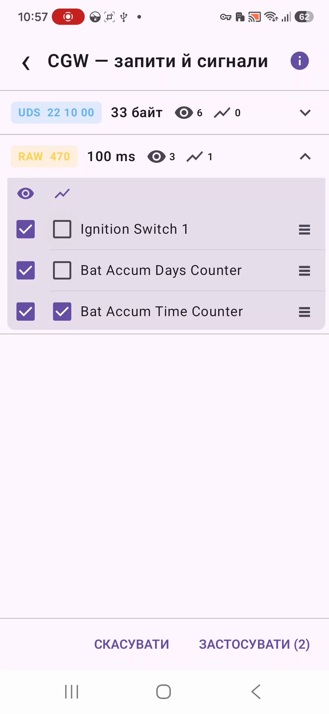

# Налаштування сигналів

Відкрийте **Сигнали** в меню головного екрана, щоб вибрати, які сигнали PROJECT YFA зчитує та як вони відображаються у режимах **Live** і **Plot**.

Налаштування сигналів зберігаються окремо для кожного ECU. З **USB CANnectivity** зведена вкладка **ECUs** також відкриває спільний редактор сигналів. У ньому показано групи з усіх підтримуваних профілів ECU, але кожен вибір усе одно зберігається для відповідного ECU.

У зведеному редакторі кожна група починається з назви ECU (наприклад, назва ECU та UDS-запит або RAW CAN ID). Вміст редактора залежить від поточного режиму зчитування так само, як для окремого ECU. Застосування доступне, якщо в усій спільній конфігурації активна хоча б одна група.

## Що показує редактор

Вміст редактора залежить від режиму, вибраного в **Налаштування → Підключення → Режим зчитування**:

- **Raw CAN** — показує групи RAW CAN;
- **Пасивний UDS** — показує групи UDS-запитів;
- **Активний UDS** — показує групи UDS-запитів;
- **Запитувати** — показує і UDS, і RAW-групи, щоб обидва варіанти можна було підготувати до запуску зчитування.

UDS-групи позначені **UDS** та байтами запиту. RAW-групи позначені **RAW** та CAN ID.

Для UDS у рядку показано очікувану довжину відповіді та, якщо він є, коментар із каталогу. Для RAW CAN показано налаштований інтервал оновлення відповідного CAN ID.

Кожна група також показує кількість сигналів, вибраних для LIVE та PLOT.

<figure markdown="span">
  { width="420" }
  <figcaption>Редактор сигналів із групами запитів та окремим вибором LIVE і PLOT.</figcaption>
</figure>

## Розгортання групи

Торкніться групи UDS або RAW, щоб розгорнути список її сигналів.

Кожен сигнал може незалежно брати участь у чотирьох функціях:

- **LIVE** — колонка з оком. Показує сигнал як поточне числове значення.
- **PLOT** — колонка з графіком. Додає сигнал до історії та відображення Plot.
- **MQTT** — колонка з хмарою надсилання. Дозволяє публікувати сигнал на налаштований MQTT broker.
- **Сповіщення** — колонка з дзвіночком. Відкриває або вмикає конфігурацію звукового сповіщення для сигналу.

Сигнал можна вибрати для будь-якої комбінації цих функцій. Йому не обов'язково бути видимим у LIVE, щоб зчитуватися для PLOT, MQTT або сповіщення.

Ряд значків над розгорнутим списком сигналів також працює як групове керування. Натискання **LIVE**, **PLOT** або **MQTT** відкриває невелике меню з командами **Вибрати всі** та **Зняти вибір з усіх** для цієї групи.

Група активна, якщо принаймні один її сигнал потрібен LIVE, PLOT, MQTT або ввімкненому сповіщенню. Якщо жодна з цих функцій не потребує сигналів групи, вона стає неактивною.

!!! note "Примітка"
    Сигнали, вибрані лише для PLOT, MQTT або сповіщення, все одно беруть участь у зчитуванні, хоча не показуються у сітці Live.

## Порядок сигналів

Порядок у цьому редакторі також визначає налаштований порядок відображення.

Натисніть і перетягніть маркер **≡** праворуч від рядка сигналу, щоб перемістити його. PROJECT YFA зберігає цей порядок окремо для кожного запиту або CAN-групи.

Під час перетягування сигналу звичайна навігація редактора та дії Застосувати/Скасувати тимчасово блокуються, щоб не залишити екран посеред операції зміни порядку.

## Застосування змін

Натисніть **ЗАСТОСУВАТИ (n)**, щоб зберегти конфігурацію ECU. Число в дужках — кількість активних груп, які зараз показує редактор.

**Скасувати** або кнопка назад закриває редактор без застосування поточних змін.

Застосування доступне, коли конфігурація ECU містить принаймні одну активну групу запиту або CAN. Група може бути активною через LIVE, PLOT, MQTT або ввімкнене сповіщення.

## Як вибір впливає на зчитування

### Raw CAN

У режимі Raw CAN PROJECT YFA відстежує ввімкнені CAN ID. Усередині цих груп сигнали, вибрані для LIVE або PLOT, входять до конфігурації зчитування.

Сигнали LIVE показуються в таблиці Live. Сигнали PLOT доступні для історії графіка.

### Пасивний UDS

У Пасивному UDS увімкнені UDS-групи визначають, які вибрані відповіді цікавлять PROJECT YFA. З USB-адаптером PROJECT YFA прослуховує трафік відповідей ECU, який уже присутній у CAN-шині, і не передає ці запити.

### Активний UDS

В Активному UDS увімкнені UDS-групи визначають діагностичні запити, які опитує PROJECT YFA. Тому вибір хоча б одного сигналу LIVE або PLOT вмикає його батьківський запит.

У цьому редакторі пропонуються лише запити, для яких база PROJECT YFA містить визначення live-сигналів.

## Попередження про навантаження ELM327 у RAW CAN

Коли вибрано **Bluetooth ELM327**, PROJECT YFA оцінює навантаження послідовними даними, яке створюють увімкнені RAW CAN ID.

Якщо оцінка досягає порога високого навантаження програми, з'являється індикатор попередження. Це ймовірніше, коли вибрано багато CAN ID, особливо з короткими інтервалами оновлення.

Щоб зменшити послідовний трафік ELM327, вимкніть непотрібні RAW-групи.

Для USB-транспорту gs_usb це попередження **не застосовується**.

## Значення за замовчуванням та оновлення бази

PROJECT YFA зберігає ці параметри у приватному сховищі програми.

Стандартні UDS-запити визначені окремо для кожного ECU. Для стандартних запитів доступні LIVE-сигнали початково видимі. RAW CAN-групи за замовчуванням вимкнені, хоча їхні визначення сигналів уже підготовлені для вибору.

Коли вбудована база запитів/сигналів PROJECT YFA змінюється, збережена конфігурація узгоджується з новою базою. Чинні налаштування видимості, PLOT і порядку зберігаються; видалені сигнали зникають, а нові сигнали автоматично додаються до конфігурації.

Завдяки цьому оновлення програми або бази може додавати нові декодовані сигнали без втрати наявного користувацького компонування.

## Пов'язані сторінки

На сторінці **Live Signals** описано результат у Live/Plot та поведінку режимів зчитування. На сторінці **Налаштування** описано вибір режиму зчитування та транспорту адаптера.
